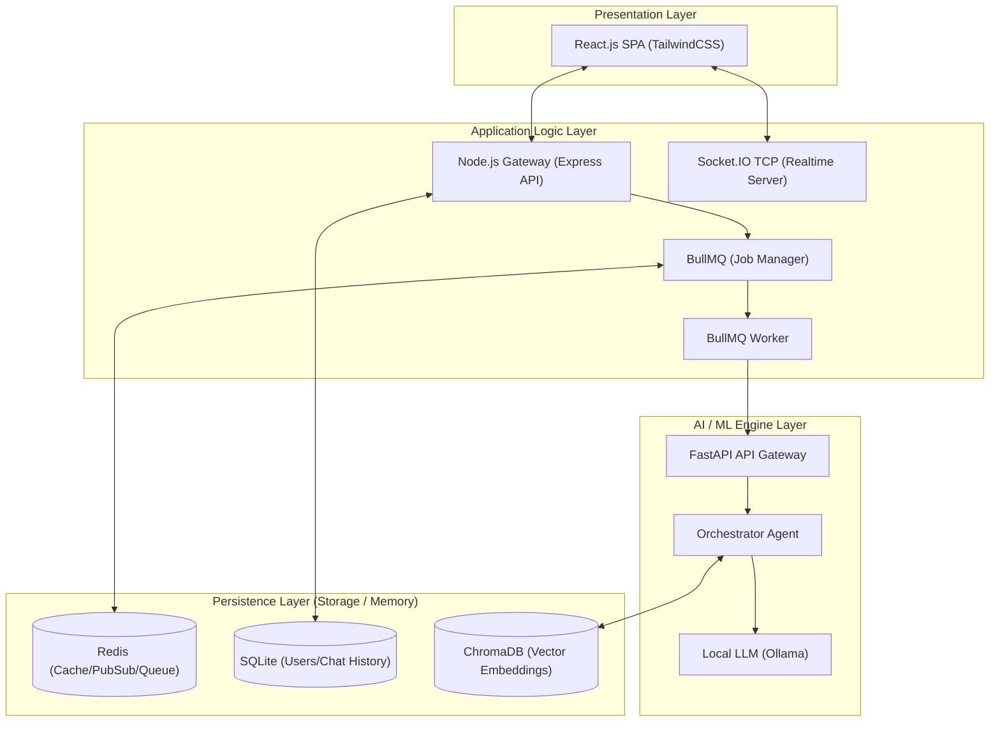
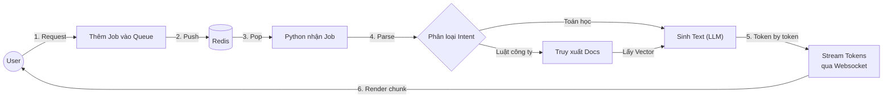
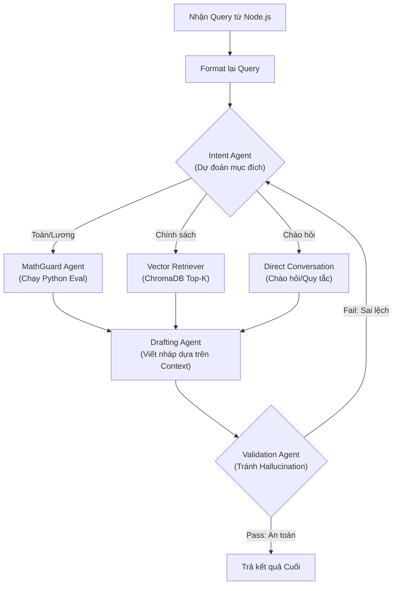

# ChatBot🧬🤖

Trợ lý ảo AI thông minh phục vụ nội bộ, chuyên hỗ trợ giải đáp thắc mắc về domain chuyên sâu,thông qua công nghệ RAG (Retrieval-Augmented Generation).Được thiết kế linh hoạt để chạy được trên cả CPU và GPU.

## 🌟 Tính năng nổi bật

- **Hỏi đáp thông minh (RAG)**: Truy xuất kiến thức trực tiếp từ các tài liệu (PDF, Docx).
- **Phân tích công thức (MathGuard)**: Tự động nhận diện và tính toán các công thức phức tạp (lương, thuế,...).
- **Giao diện ChatGPT-style**: Trải nghiệm trò chuyện mượt mà, hỗ trợ đa ngôn ngữ (Tiếng Việt, Tiếng Trung, Tiếng Anh).
- **Hủy bỏ yêu cầu tức thì (True Abortion)**: Khả năng dừng tạo câu trả lời ngay lập tức để tiết kiệm tài nguyên.
- **Quản lý hội thoại**: Lưu trữ lịch sử chat, quản lý Thread thông minh.

## 🏗️ Kiến trúc hệ thống



### 2. Data Flow Pipeline (End-to-End Execution)
Luồng đi của một câu hỏi từ khi Người dùng gõ đến khi có kết quả Realtime.


### 3. Workflow của Agent Loop (RAG Logic)
Quy trình ra quyết định của tác tử AI bên trong tầng Python FastAPI.


1.  **Frontend (React + Vite + Tailwind)**: Giao diện người dùng hiện đại, responsive.
2.  **Backend (Node.js + Express + BullMQ)**: Xử lý logic nghiệp vụ, quản lý hàng chờ (Job Queue) và kết nối Socket.IO truyền dữ liệu realtime.
3.  **RAG Service (Python + FastAPI)**: "Bộ não" AI xử lý ngôn ngữ tự nhiên, truy xuất tài liệu và chạy mô hình LLM.
4.  **Database**:
    *   **SQLite**: Lưu trữ user, thread và tin nhắn.
    *   **Redis**: Backing store cho hàng chờ công việc BullMQ.
    *   **ChromaDB**: Cơ sở dữ liệu vector để lưu trữ và truy xuất tài liệu nội bộ một cách nhanh chóng.

## 🚀 Hướng dẫn cài đặt

### 1. Yêu cầu hệ thống
- Node.js v18+
- Python 3.10+
- Redis Server
- Ollama (để chạy LLM local)

### 2. Cài đặt các thành phần

#### RAG Service (Python)
```bash
cd rag-service
python -m venv venv
source venv/bin/activate  # Hoặc venv\Scripts\activate trên Windows
pip install -r requirements.txt
```

#### Backend (Node.js)
```bash
cd backend
npm install
```

#### Frontend (React)
```bash
cd frontend
npm install
```

### 3. Cấu hình
- Tạo file `.env` trong thư mục `backend` dựa trên các biến môi trường cần thiết (PORT, REDIS_URL, RAG_SERVICE_URL).
- Đảm bảo Ollama đang chạy và đã pull model (mặc định là `qwen2.5:7b` hoặc tương đương).
-Thêm các file data có dạng docx,pdf,txt... vào thư mục ./rag-service/data để vector embedding data.

### 4. Khởi chạy
- **Python**: `python -m src.api.server` (trong thư mục `rag-service`)
- **Backend**: `npm start` (trong thư mục `backend`)
- **Frontend**: `npm run dev` (trong thư mục `frontend`)

## 🛡️ Bảo mật & Hiệu năng
- Hệ thống hỗ trợ dừng xử lý ngầm khi client ngắt kết nối.
- Cơ chế Sequential Worker đảm bảo ổn định tài nguyên hệ thống.
- MathGuard đảm bảo tính chính xác cho các phép tính kỹ thuật.

---
© 2imyuH.
