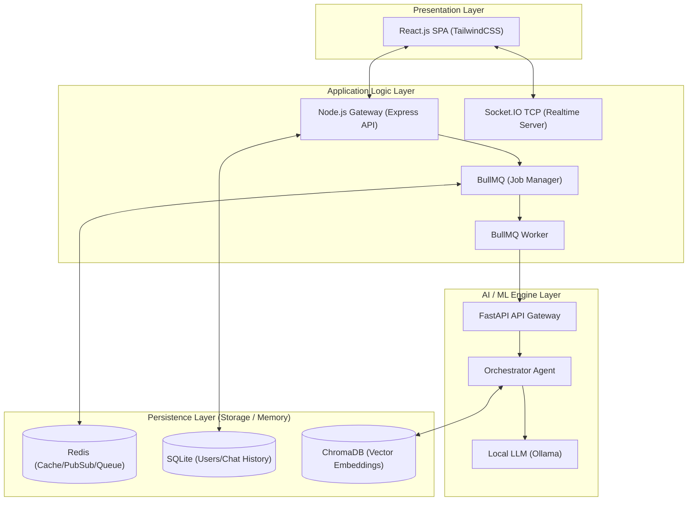
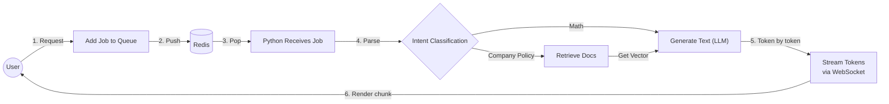
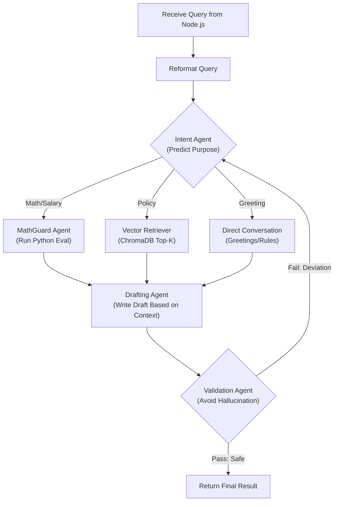

# ChatBot

Internal AI virtual assistant that answers domain-specific questions using Retrieval-Augmented Generation (RAG). Designed to run flexibly on both CPU and GPU.

## Key Features

- **Intelligent Q&A (RAG)**: Retrieves knowledge directly from documents (PDF, DOCX).
- **Formula Analysis (MathGuard)**: Automatically detects and computes complex formulas (salary, tax, etc.).
- **ChatGPT-style Interface**: Smooth conversational experience with multi-language support (Vietnamese, Chinese, English).
- **True Abortion**: Ability to stop response generation instantly to save resources.
- **Conversation Management**: Stores chat history and manages threads intelligently.

## System Architecture


```mermaid
graph TD
    subgraph "Presentation Layer"
        UI["React.js SPA (TailwindCSS)"]
    end

    subgraph "Application Logic Layer"
        API["Node.js Gateway (Express API)"]
        SOCKET["Socket.IO TCP (Realtime Server)"]
        QUEUE["BullMQ (Job Manager)"]
        WORKER["BullMQ Worker"]
    end

    subgraph "AI / ML Engine Layer"
        FASTAPI["FastAPI API Gateway"]
        AGENT["Orchestrator Agent"]
        LLM["Local LLM (Ollama)"]
    end

    subgraph "Persistence Layer (Storage / Memory)"
        REDIS[("Redis (Cache/PubSub/Queue)")]
        SQLITE[("SQLite (Users/Chat History)")]
        CHROMA[("ChromaDB (Vector Embeddings)")]
    end

    UI <--> API
    UI <--> SOCKET
    API --> QUEUE
    QUEUE <--> REDIS
    QUEUE --> WORKER
    WORKER --> FASTAPI
    FASTAPI --> AGENT
    AGENT --> LLM
    API <--> SQLITE
    AGENT <--> CHROMA
```

### 2. Data Flow Pipeline (End-to-End Execution)
The path a question takes from the moment the user types it to when a real-time result is returned.

```mermaid
graph LR
    USER((User))
    API["Add Job to Queue"]
    REDIS[("Redis")]
    WORKER["Python Receives Job"]
    ROUTER{"Intent Classification"}
    QA["Retrieve Docs"]
    LLM["Generate Text (LLM)"]
    SOCKET["Stream Tokens<br>via WebSocket"]

    USER -->|1. Request| API
    API -->|2. Push| REDIS
    REDIS -->|3. Pop| WORKER
    WORKER -->|4. Parse| ROUTER
    
    ROUTER -->|Math| LLM
    ROUTER -->|Company Policy| QA
    
    QA -->|Get Vector| LLM
    LLM -->|5. Token by token| SOCKET
    SOCKET -->|6. Render chunk| USER
```

### 3. Agent Loop Workflow (RAG Logic)
The decision-making process of the AI agent within the Python FastAPI layer.

```mermaid
graph TD
    INPUT["Receive Query from Node.js"]
    FORMAT["Reformat Query"]
    
    INTENT{"Intent Agent<br/>(Predict Purpose)"}
    
    TOOL1["MathGuard Agent<br/>(Run Python Eval)"]
    TOOL2["Vector Retriever<br/>(ChromaDB Top-K)"]
    TOOL3["Direct Conversation<br/>(Greetings/Rules)"]
    
    DRAFT["Drafting Agent<br/>(Write Draft Based on Context)"]
    VALIDATE{"Validation Agent<br/>(Avoid Hallucination)"}
    
    OUTPUT["Return Final Result"]

    INPUT --> FORMAT
    FORMAT --> INTENT
    
    INTENT -->|Math/Salary| TOOL1
    INTENT -->|Policy| TOOL2
    INTENT -->|Greeting| TOOL3
    
    TOOL1 --> DRAFT
    TOOL2 --> DRAFT
    TOOL3 --> DRAFT
    
    DRAFT --> VALIDATE
    
    VALIDATE -->|Fail: Deviation| INTENT
    VALIDATE -->|Pass: Safe| OUTPUT
```

1.  **Frontend (React + Vite + Tailwind)**: Modern, responsive user interface.
2.  **Backend (Node.js + Express + BullMQ)**: Handles business logic, manages the job queue, and connects Socket.IO for real-time data transfer.
3.  **RAG Service (Python + FastAPI)**: The AI "brain" that processes natural language, retrieves documents, and runs the LLM.
4.  **Database**:
    *   **SQLite**: Stores users, threads, and messages.
    *   **Redis**: Backing store for the BullMQ job queue.
    *   **ChromaDB**: Vector database for fast storage and retrieval of internal documents.

## Installation Guide

### 1. System Requirements
- Node.js v18+
- Python 3.10+
- Redis Server
- Ollama (to run the local LLM)

### 2. Installing Components

#### RAG Service (Python)
```bash
cd rag-service
python -m venv venv
source venv/bin/activate  # Or venv\Scripts\activate on Windows
pip install -r requirements.txt
```

#### Backend (Node.js)
```bash
cd backend
npm install
```

#### Frontend (React)
```bash
cd frontend
npm install
```

### 3. Configuration
- Create a `.env` file in the `backend` directory based on the required environment variables (PORT, REDIS_URL, RAG_SERVICE_URL).
- Make sure Ollama is running and the model has been pulled (default is `qwen2.5:7b` or equivalent).
- Add data files (DOCX, PDF, TXT, etc.) to the `./rag-service/data` directory for vector embedding.

### 4. Running the System
- **Python**: `python -m src.api.server` (from the `rag-service` directory)
- **Backend**: `npm start` (from the `backend` directory)
- **Frontend**: `npm run dev` (from the `frontend` directory)

## Security & Performance
- The system supports stopping background processing when the client disconnects.
- The Sequential Worker mechanism ensures stable system resource usage.
- MathGuard ensures accuracy for technical calculations.

---
© 2imyuH.
